<p align="center">
  
</p>

<p align="center">
  
</p>

<p align="center">
MentraAI turns Discord into a gamified cybersecurity learning arena with quizzes, flashcards, study plans, and synced leaderboards connected to a web dashboard.
</p>

<p align="center">
  
  
  
  
  
  
</p>
<p align="center">
  <a href="#install"><b>Get Started</b></a> •
  <a href="#features"><b>Features</b></a> •
  <a href="#web"><b>Web Platform</b></a> •
  <a href="#architecture"><b>Architecture</b></a>
</p>

<p align="center">
  
</p>

<p align="center">
  <a href="https://www.youtube.com/watch?v=AT6crSpQN88" target="_blank">
    
  </a>
</p>

## 📚 Table of Contents

- [Why MentraAI Matters](#why)
- [Rethinking Cybersecurity Learning](#rethinking)
- [Core Highlights](#highlights)
- [Inside the AI Engine](#engine)
- [Key Features](#features)
- [Commands](#commands)
- [Web Platform](#web)
- [Architecture Overview](#architecture)
- [Installation & Setup](#install)
- [Project Structure](#structure)
- [Security](#security)
- [License](#license)

> [!NOTE]  
> Built for the **OffSec Community Challenge (MCPs)**: practical, useful, a real learning workflow for the community.  
>  
> Community members are welcome to review the project and leave feedback in the Art & Style channel on the official OffSec Discord.

<a id="why"></a>
## 🎯 Why MentraAI Matters

MentraAI turns community learning into a **repeatable training loop**.

- **Discord-native**: study where communities already learn  
- **AI training modes**: ask → quiz → flashcards → plan  
- **Persistent progress**: stats + history + dashboard  
- **Competition layer**: ranks, leaderboards, seasons  


<a id="rethinking"></a>
## 🧩 Rethinking Cybersecurity Learning

Most learners study in Discord — but progress is **unstructured** and **hard to track**.

MentraAI fixes that by combining:
- **Structure** (plans + tasks)
- **Reinforcement** (quizzes + flashcards)
- **Motivation** (rankings + seasons)
- **Persistence** (dashboard + history)

<a id="engine"></a>
## 🧠 Inside the AI Engine

MentraAI is not just “connected” to an AI model — the whole system is designed around how AI structures, explains, and tests cybersecurity knowledge.

Instead of answering one-off questions, the AI acts as a training engine that can:
- Generate clear, structured explanations
- Build context-aware quizzes and assessments
- Create flashcards for active recall
- Design longer-term study roadmaps
- Adapt content based on topics selected by the user

This turns AI from a passive Q&A tool into a guided learning system that:
- Encourages consistent practice
- Simulates applied reasoning instead of rote memorization
- Reinforces retention with repetition and variation
- Keeps progress measurable through shared Discord + Web data

<a id="highlights"></a>
## 🚀 Core Highlights

✔ Intelligent Intent Detection  
✔ Dual Interaction Mode (Slash + Natural Chat)  
✔ Persistent Progress Tracking  
✔ Gamified Leaderboard System  
✔ PDF → Structured Study Plans  
✔ Modular AI Service Layer  

<a id="features"></a>
## ⚙️ Key Features

### Ask 

Ask cybersecurity questions (or anything else) without leaving Discord.
<p>
  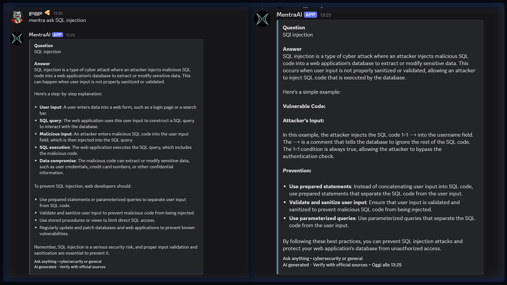
</p>

MentraAI explains concepts in a clear, structured, and practical way — from basics to more advanced topics.

**How to use:**
- Slash command: `/ask topic:<your question>`
- Natural chat

Typical uses:
- Reviewing concepts (e.g. SQL injection, AD, web vulns)
- Clarifying commands, tools, or acronyms
- Getting quick explanations while studying
- Ask everything

### Quiz

A Discord AI bot capable of generating on-demand quizzes in seconds.
<p>
  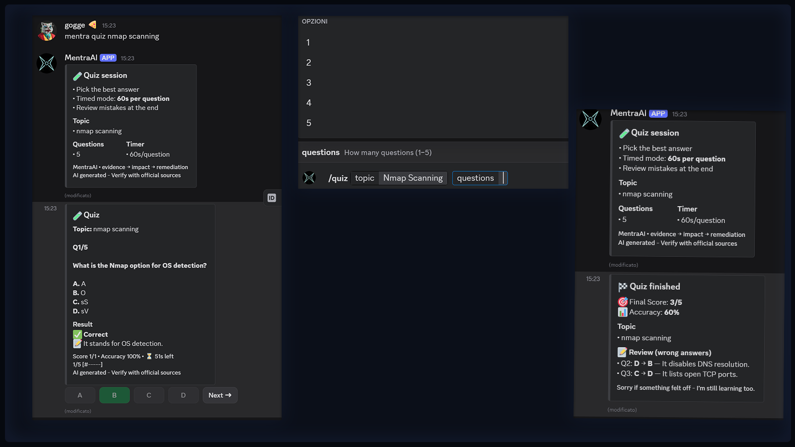
</p>
You can:
- Choose 1–5 questions per quiz
- Select one of the suggested cybersecurity topics
- Or provide your own custom topic

MentraAI builds timed quizzes that test understanding, not just memorization

### Flashcards

Create flashcards on the fly to reinforce key concepts through active recall.
<p>
  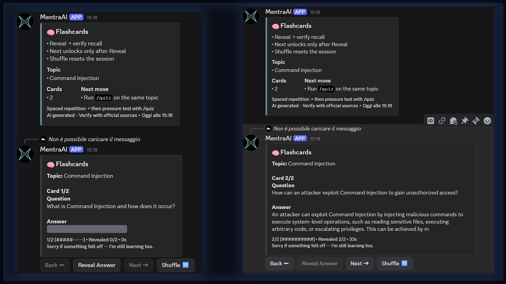
  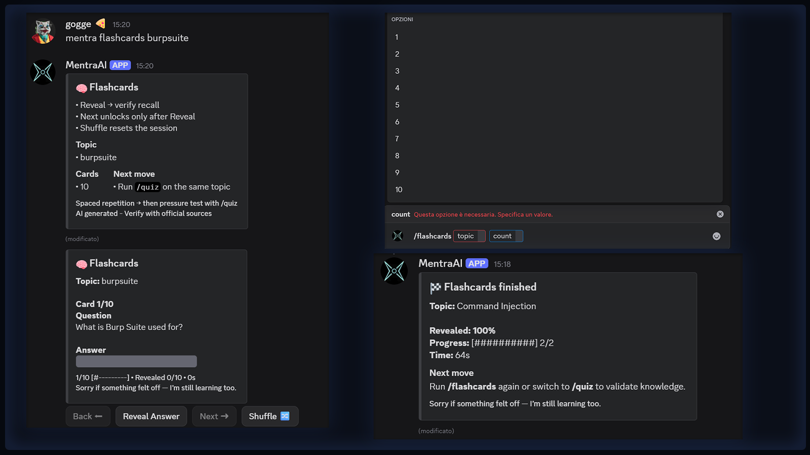
</p>
You can:
- Generate up to 10 flashcards per session
- Target specific topics (e.g. Nmap, Windows fundamentals, web vulns)
- Quickly cycle through “question → reveal answer” loops

This is ideal for tightening weak areas before an exam or a lab session.


### Study Plans

Generate structured study plans tailored to a topic and duration.
<p>
  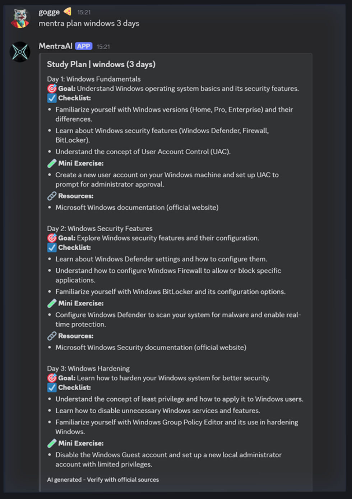
</p>

MentraAI can build plans up to **95 days**, broken down into:
- Daily goals
- Tasks and reading
- Practical exercises and review blocks

All plans are generated inside Discord and synchronized with the web platform


### 🏆 Leaderboard & Ranking System

MentraAI includes a fully integrated ranking system to keep the community motivated.

<p>
  
</p>

Every quiz session contributes to your stats. The bot tracks:
- Points earned
- Accuracy percentage
- Total quizzes completed
- Performance by topic
- Monthly season rankings
- Most-played topics
- Personal rank with `/rankme`

Multiple leaderboard views are available (global, topic-based, season, accuracy), turning solo practice into a community-driven challenge.


<a id="commands"></a>
## 💻 Commands
###  Intelligent Command Routing

MentraAI doesn't just wait for commands — it understands context.

You can:

• Use slash commands  
• Type `mentra quiz web 3`  
• Or just ask a question naturally  

✅  MentraAI detects intent automatically.

Example:

<p>
  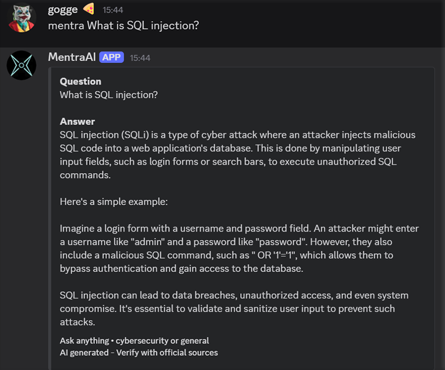
</p>


### Learning Commands

| Command | Description | Example |
|---------|-------------|---------|
| `/ask` | Ask cybersecurity questions or any topic | `/ask topic:SQL injection` |
| `/quiz` | Generate timed quizzes (1–5 questions) | `/quiz topic:web 3` |
| `/flashcards` | Generate active recall flashcards | `/flashcards topic:Nmap 5` |
| `/plan` | Create structured study plans | `/plan topic:AD days:30` |

### Ranking Commands

| Command | Description | Example |
|---------|-------------|---------|
| `/rank` | Global leaderboard | `/rank` |
| `/rank topic:<topic>` | Topic-specific rankings | `/rank topic:web` |
| `/rank season:true` | Current season leaderboard | `/rank season:true` |
| `/rank alltime:true` | All-time rankings | `/rank alltime:true` |
| `/rank_accuracy` | Accuracy-based rankings | `/rank_accuracy` |
| `/rankme` | Your personal rank | `/rankme` |
| `/season_winner` | Current season winner | `/season_winner` |

### Stats & Utilities

| Command | Description |
|---------|-------------|
| `/stats` | Server-wide quiz statistics |
| `/topics` | Available quiz topics |
| `/resources` | Cybersecurity learning resources |
| `/usersetkey` | Set personal API key (admin) |
| `/userdelkey` | Remove user API key (admin) |
| `/wipe_admin` | Admin data wipe |

<p>
  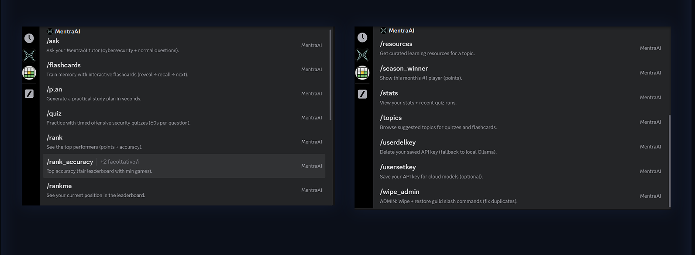
</p>

<a id="web"></a>
## 🌐 Web Platform

The dashboard keeps your learning **persistent** and **measurable**.

- **Discord OAuth login**
- **Synced leaderboard**
- **Profile + stats history**
- **MentraScan**: PDF/notes → 7 - day plan
- **Integrated assistant** for tasks & concepts


## 🔐 Discord OAuth Integration

The web platform uses **Discord OAuth authentication**, allowing users to:
- Log in with their Discord profile  
- Automatically sync quiz history and stats  
- Access their personal progress dashboard  

Your identity and activity remain connected across platforms.


## 🏆 Web Leaderboard
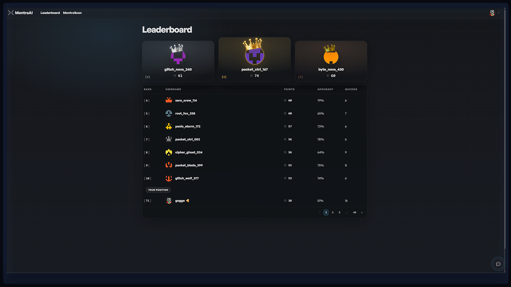
The web leaderboard is fully connected to the Discord ranking system and shows:
- Global rankings  
- Points  
- Accuracy  
- Quiz count  
- Real-time positioning  

All powered by the same database used by the bot.

##  Personal Profile Dashboard
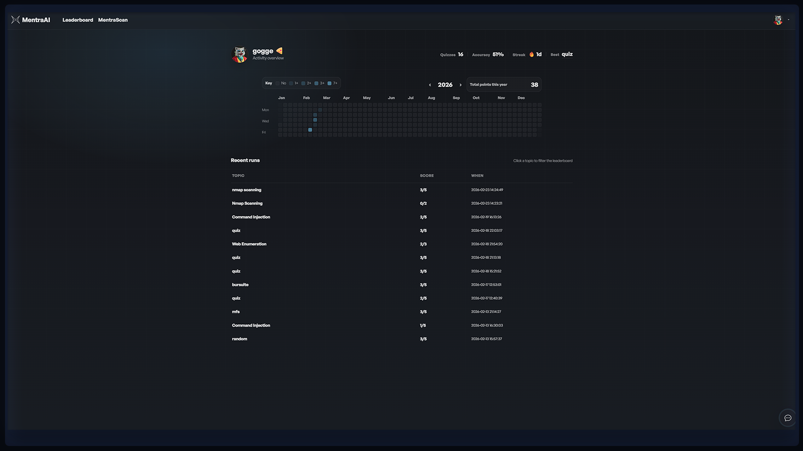
Each user has a personal dashboard showing:
- Total quizzes  
- Accuracy  
- Streak  
- Best quiz  
- Activity heatmap  
- Recent runs  

This turns learning into measurable, visible progress.


## 🧠 MentraScan 
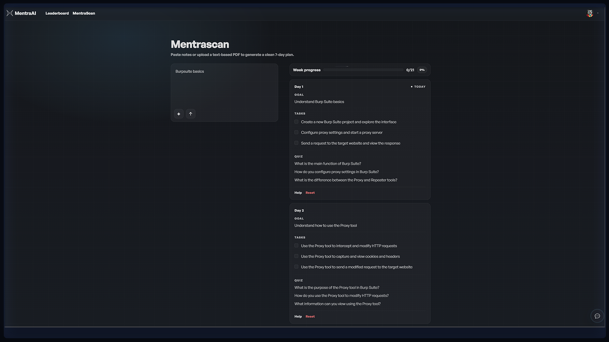
MentraScan allows users to:
- Paste personal notes  
- Upload a text-based PDF  
- Generate a clean **7-day study plan**  

The generated plan includes:
- Daily goals  
- Structured tasks  
- Mini quizzes  
- Progress tracking  

Everything is stored in the database, plan persists after logout and across future logins.

## 💬 Integrated Study Chatbot
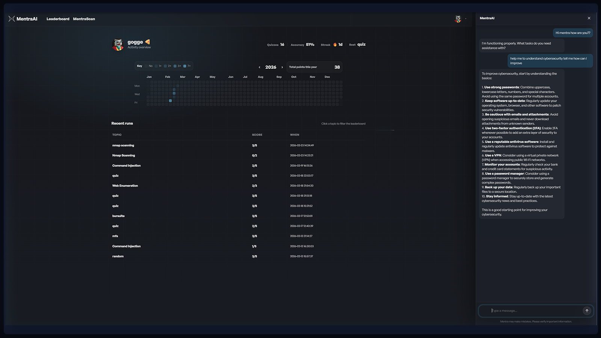
While using MentraScan, users can access an integrated chatbot that:
- Helps clarify study tasks  
- Explains concepts  
- Assists during exercises  
- Supports deeper understanding  

This creates an assisted learning environment, not just a static planner.

## Persistent Progress Tracking
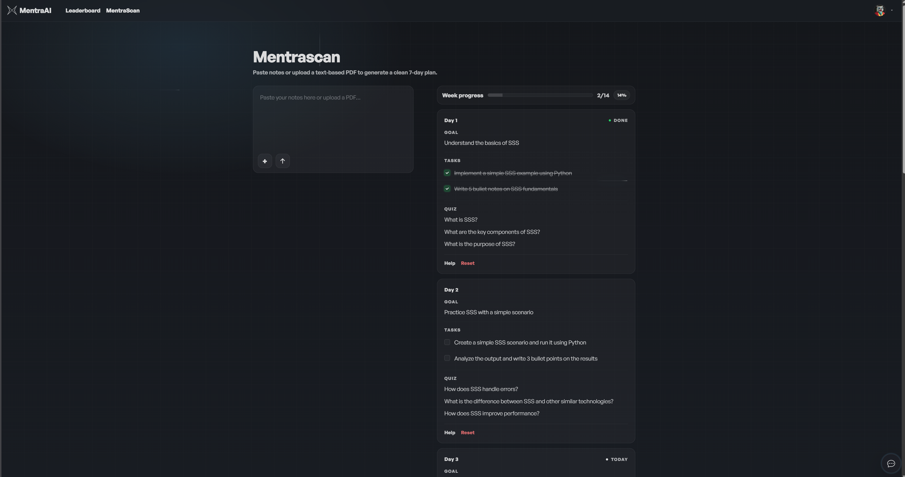
Task completion is tracked visually and stored permanently.

Completed tasks remain saved in the database and contribute to overall study consistency.

<a id="architecture"></a>
## Architecture Overview
<p>
  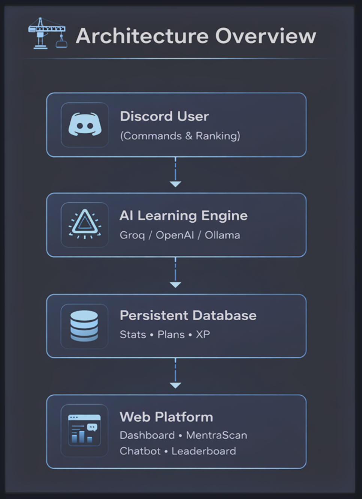
</p>

MentraAI is a dual-layer system:
- **Discord bot** handles interaction + game loop  
- **AI services** generate content (ask/quiz/cards/plans)  
- **Database** persists stats, history, plans  
- **Web app** exposes dashboard + MentraScan  
<a id="install"></a>
## 🚀 Installation & Setup

MentraAI is composed of:
- A Discord AI Bot  
- A Web Platform (OAuth + Dashboard + MentraScan)  
- A Shared Database  

Both layers are fully synchronized.

## Clone the Repository

```bash
git clone https://github.com/yourusername/mentraai.git
cd mentraai
```

## 🔐 Discord Default Install Settings

Inside the Discord Developer Portal:

Create a new Application

Go to Bot -> Add Bot

Enable required intents

Go to OAuth2 → Redirects

Add your callback URL (e.g. http://127.0.0.1:8000/auth/callback)

Invite the bot to your server

⚠️ You must insert your own Groq API key.

### User Install
Scope:
- `applications.commands`

### Guild Install
Scopes:
- `applications.commands`
- `bot`

### Required Bot Permissions
- Send Messages
- Use Slash Commands
- Embed Links
- Read Message History

MentraAI does not require Administrator permissions.

##  Create Environment Variables
Check the env.example or create your own in the root directory 

DISCORD_TOKEN=your_discord_bot_token
DISCORD_CLIENT_ID=your_discord_client_id
DISCORD_CLIENT_SECRET=your_discord_client_secret

GROQ_API_KEY=your_groq_api_key

DATABASE_URL=sqlite:///./mentra.db
SECRET_KEY=your_super_secret_key

⚠️ You must insert your own Groq API key.
You can generate one at: https://console.groq.com/


## Install Dependencies
```bash
pip install -r requirements.txt
```

## Run the Discord Bot
```bash
python bot.py
```

## Run the Web Application
```bash
uvicorn app.main:app --reload
```
Open your browser at:
http://127.0.0.1:8000

MentraAI supports:
Groq (recommended )
OpenAI
Local Ollama (recommended qwen2.5:14b-instruct-q5_K_M )

<a id="structure"></a>
## 📁 Project Structure
```
MENTRA-STUDY-BOT/
│
├── app/
│   ├── commands/
│   │   ├── admin.py
│   │   ├── chat_ai_router.py
│   │   ├── chat_router.py
│   │   ├── flashcards_commands.py
│   │   ├── quiz_commands.py
│   │   ├── stats_commands.py
│   │   ├── study.py
│   │   └── ui_modals.py
│   │
│   ├── models/
│   │   ├── cards.py
│   │   └── quiz.py
│   │
│   ├── prompts/
│   │   ├── mentra_plan.py
│   │   ├── mentra_scan.py
│   │   ├── mentra_scan_pdf.py
│   │   └── agent_prompts/
│   │       ├── base.txt
│   │       └── __init__.py
│   │
│   ├── services/
│   │   ├── ask_format.py
│   │   ├── exam_rules.py
│   │   ├── flashcards_gen.py
│   │   ├── llm.py
│   │   ├── pdf_notes.py
│   │   ├── plan_preset_90days.py
│   │   ├── quiz_gen.py
│   │   ├── status_rotation.py
│   │   └── study_planner.py
│   │
│   ├── utils/
│   │   ├── discord_ui.py
│   │   ├── embeds.py
│   │   ├── loading.py
│   │   ├── logger_setup.py
│   │   ├── perms.py
│   │   ├── single_instance.py
│   │   ├── startup_banner.py
│   │   └── text.py
│   │
│   ├── views/
│   │   ├── flashcards_view.py
│   │   ├── quiz_view.py
│   │   ├── topic_picker.py
│   │   └── components/
│   │       ├── flashcards_buttons.py
│   │       └── quiz_buttons.py
│   │
│   └── web/
│       ├── core/
│       │   ├── deps.py
│       │   ├── ratelimit.py
│       │   └── security.py
│       │
│       ├── routes/
│       │   ├── agent_api.py
│       │   ├── api.py
│       │   ├── auth.py
│       │   ├── mentrascan.py
│       │   ├── notes.py
│       │   └── pages.py
│       │
│       ├── static/
│       │   ├── css/
│       │   ├── img/
│       │   └── js/
│       │
│       ├── templates/
│       │   ├── base.html
│       │   ├── leaderboard.html
│       │   ├── mentrascan.html
│       │   ├── user.html
│       │   ├── components/
│       │   │   └── agent_widget.html
│       │   └── partials/
│       │       └── mentra_widget.html
│       │
│       ├── main.py
│       ├── constants.py
│       └── db.py
│
├── assets/
│   ├── img/
│   │   ├── banner.png
│   │   ├── Banner.svg
│   │   └── mentra.gif
│   └── screens/
│
├── data/
│   └── scripts/
│
├── bot.py
├── config.py
├── requirements.txt
├── .env.example
├── .gitignore
├── LICENSE
├── README.md
├── SECURITY.md
```

<a id="security"></a>
## 🔐 Security

If you discover a vulnerability, please refer to the [Security Policy](SECURITY.md).
## 🎬 Demo
- Full walkthrough: [(YouTube link)](https://www.youtube.com/watch?v=AT6crSpQN88)
- Screenshots: see `/assets/screens/`

<a id="license"></a>
## 📜 License

MentraAI is released under the **MIT License**.


See the full license text here: [LICENSE](LICENSE).


---

<p align="center">
  <b>MentraAI</b> — Structured AI-Powered Cybersecurity Training
</p>

<p align="center">
  Built for serious learners. Designed for measurable progress.
</p>
